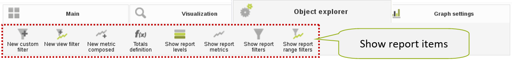

# DAC Customization

Tools for customizing the DAC layout are provided in **Settings&gt; Customization**.

Using these tools, the administrator can select one of the default themes, or select colors individually for specific parts of the user interface:

* the Logo on the Login window and the Main Toolbar; 
* the Main buttons and icons; 
* Side Navigation Menu

