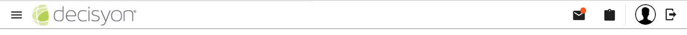
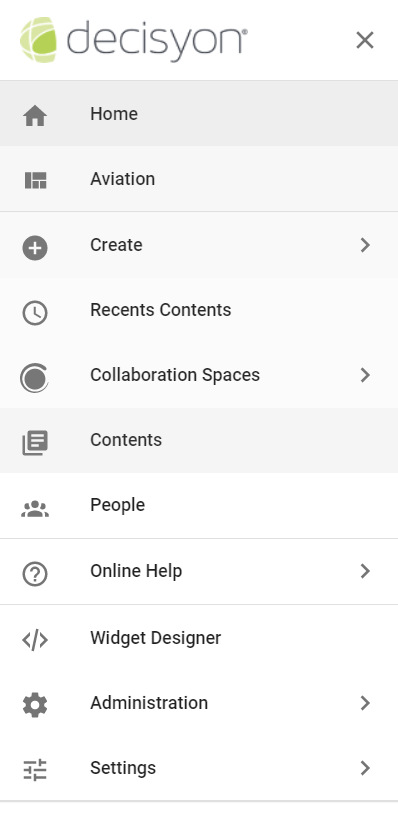

# Toolbar&Vertical Toolbar

Inserire il video Toolbar&VerticalToolbar 3

DAC's main features \(Toolbar\), shown in the following figure, are:

* On the left, opens the **Vertical Toolbar** to selected the main functions . Decisyon logo allows you to **return to DAC’s home** page.

The right side contains:

* **Notification**: opens the notifications sent to the user; above the notifications button, the number of those received and not yet viewed will appear
* **Task:** pens the list of tasks involving the user; the number of new tasks for which the user is directly responsible and still not completed will appear above the Task button.
* the **User’s** profile picture and the button that opens [the User Profile details.  ](http://documents.decisyon.com/tomcat/manuals/user/ge/en/web/userProfile.htm#_Spazi) 
* **Logout** from the DAC

It is possible to expand the main function area. Once expanded the main functions available are:

* **Home** to return to the Home Page; you can also click on the Decisyon logo
* **Aviation**, access to the pages associated with the application.
* **Create:** which opens a list for create a new Object.
* **Recent Contents** ,opens a list of the last contents viewed by the user, such as reports, pages, documents, spaces etc.
* **Spaces**, which opens a list with all available spaces for the user.
* **Contents**, to access the list of content in your environment, such as documents, blog posts and signals.
* **People**, contains the list of users, from which you can choose who to follow, send a signal, add to Favorites, etc.
* **Online Help**, which opens the online help to consult DAC manuals.
* **Widget Designer** , to access the Widget Catalog that lists the widgets and libraries created by the user. \(This section is only visible to the administrator\).
* **Administration**, which opens a panel that allows an administrator user to perform operations such as checking information about the application server and the users who are logged in, downloading the application logs etc. \(This section is only visible to the administrator\).
* **Settings** contains the list for setting the DAC's Object \(This section is only visible to the administrator\).

